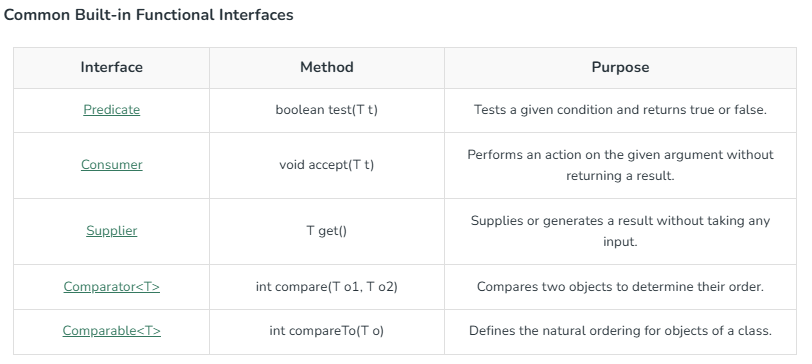
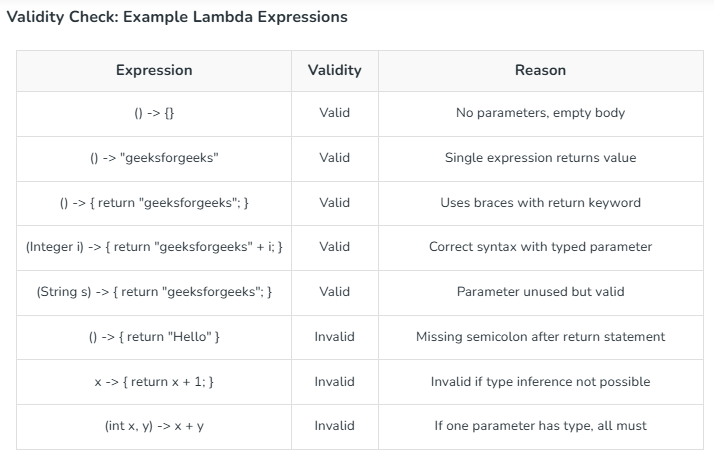
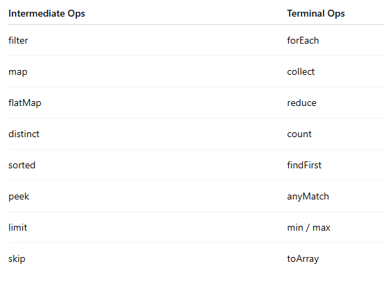

# java_8_features
List of java 8 feature with example

Lambda expressions implement a functional interface

Streams

A Stream is a sequence of elements that supports functional-style operations. Unlike Collections, a Stream does not store data it only processes it.

1.Intermediate Operations -Intermediate operations transform a stream into another stream.
2.Terminal Operations - Terminal operations produce a result or a side-effect and mark the end of the stream pipeline.

